# Top 16 Non-KYC Crypto Exchanges Ranked in 2025 (Latest Compilation)

Privacy matters when you're moving crypto around, and sometimes the last thing you want is to upload your driver's license just to swap some coins. Whether you're testing out a new token, avoiding data-hungry platforms, or simply valuing your financial anonymity, non-KYC exchanges let you trade without the paperwork parade. This guide ranks 16 platforms where you can swap Bitcoin, Ethereum, stablecoins, and hundreds of altcoins—no registration forms, no ID selfies, just wallet-to-wallet transfers that respect your time and privacy.

***

## **[Godex.io](https://godex.io)**

The anonymous swap veteran that never asks who you are.

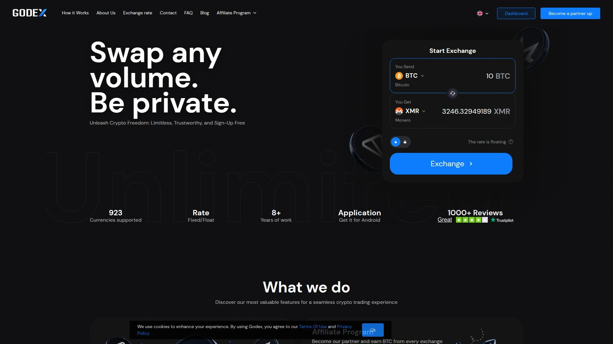

Godex has been around since the early days of instant crypto exchanges, and it still operates on a refreshingly simple principle: you want to trade, not fill out forms. The platform supports over 900 cryptocurrencies and handles swaps in both fixed-rate and floating-rate modes, so you can lock in a price or ride the market momentum depending on your strategy. There's no upper transaction limit, which means whether you're swapping $50 or $50,000 worth of crypto, Godex treats you the same—anonymously.

The user interface feels stripped down in the best way possible, like someone designed it for people who actually use crypto rather than people who want to admire their portfolio charts all day. You pick two coins, enter an amount, paste your receiving address, and send. The platform finds competitive rates across multiple liquidity sources and typically completes swaps within 5 to 30 minutes depending on blockchain confirmation speeds. Security operates through automated systems that minimize human touchpoints, and the 24/7 support team responds fast when blockchain hiccups happen.

What makes Godex particularly useful for privacy-conscious traders is the complete absence of account creation or data collection. No email signup, no phone verification, no "complete your profile" nagging—just pure transactional efficiency. The platform's rate-locking feature (available for up to 20 minutes on fixed-rate swaps) protects you from volatility while your transaction confirms, which matters more than you'd think when dealing with fast-moving altcoin markets.

---

## **[ChangeNOW](https://changenow.io)**

The fast-lane option with 1,500+ assets and minimal friction.

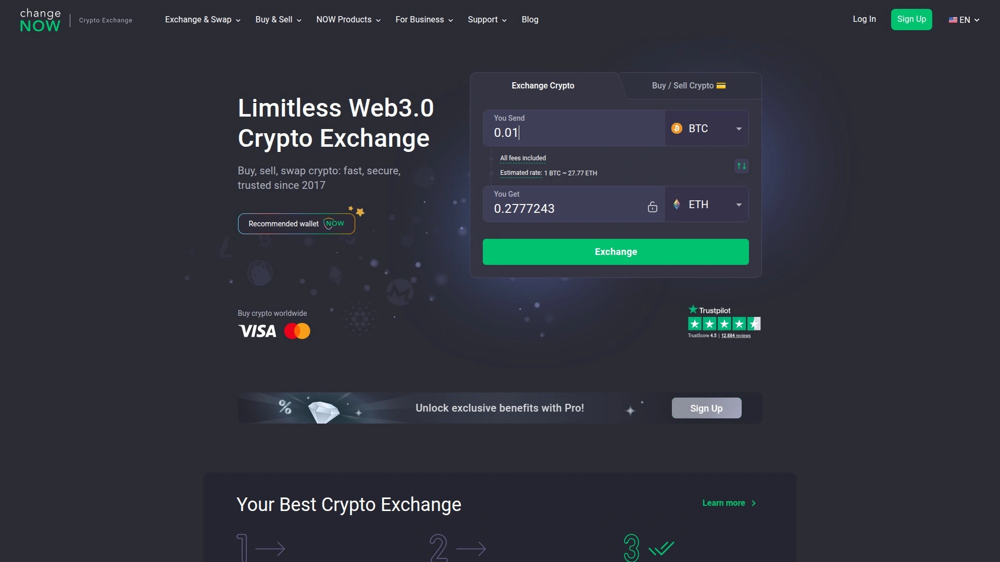

ChangeNOW built its reputation on speed, and after processing millions of swaps since 2017, the platform delivers consistent 5-minute transaction times across most trading pairs. The interface feels polished without being cluttered—you get real-time rate updates, transparent fee breakdowns, and a transaction tracker that actually tells you what's happening instead of just showing a spinning icon. Supporting over 1,500 cryptocurrencies means you can swap obscure DeFi tokens without hopping between three different platforms.

The platform operates on a flexible KYC approach: small to medium transactions (typically under certain thresholds) process without any identity verification, but the system may occasionally flag suspicious activity for review. This strikes a balance for users who want privacy but also appreciate that the platform isn't completely ignoring risk management. Mobile apps for iOS and Android bring the same functionality to your pocket, which proves useful when you need to execute a swap while away from your desk.

Customer support consistently receives positive mentions in user reviews, with response times averaging under 5 minutes during business hours and solid 24/7 availability for urgent issues. The platform doesn't require registration for basic swaps, though creating an optional account unlocks features like transaction history and saved addresses if you're the organized type.

***

## **[SimpleSwap](https://simpleswap.io)**

No-nonsense trading for people who just want to exchange crypto.

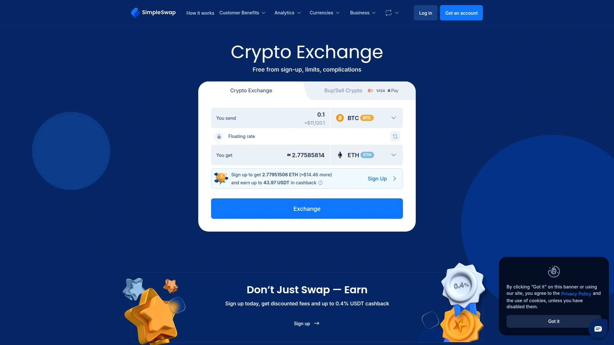

SimpleSwap lives up to its name by removing every unnecessary step from the swap process. The platform supports over 1,500 cryptocurrencies and imposes absolutely no minimum or maximum transaction limits, which makes it equally useful whether you're experimenting with $10 worth of a meme coin or moving serious liquidity. There's no account creation requirement, no KYC verification at any transaction level, and no data retention policies that would make privacy advocates nervous.

The fee structure stays transparent and competitive, with rates typically included in the displayed exchange amount rather than tacked on as surprises at checkout. Both fixed and floating rate options give you control over how you want to handle market volatility—lock in your rate if you're risk-averse, or let it float if you're feeling optimistic about price movements during confirmation. Transaction completion times average a few minutes for popular pairs, though network congestion and blockchain confirmation requirements obviously vary.

What sets SimpleSwap apart from flashier competitors is its relentless focus on the core function: swapping crypto efficiently. There are no staking products, no yield farming opportunities, no NFT marketplace integrations—just a clean exchange interface that does one thing exceptionally well. The mobile app maintains the same stripped-down philosophy, making it fast to load and simple to navigate even with spotty internet connections.

***

## **[Changelly](https://changelly.com)**

The established player with deep liquidity and cross-platform reach.

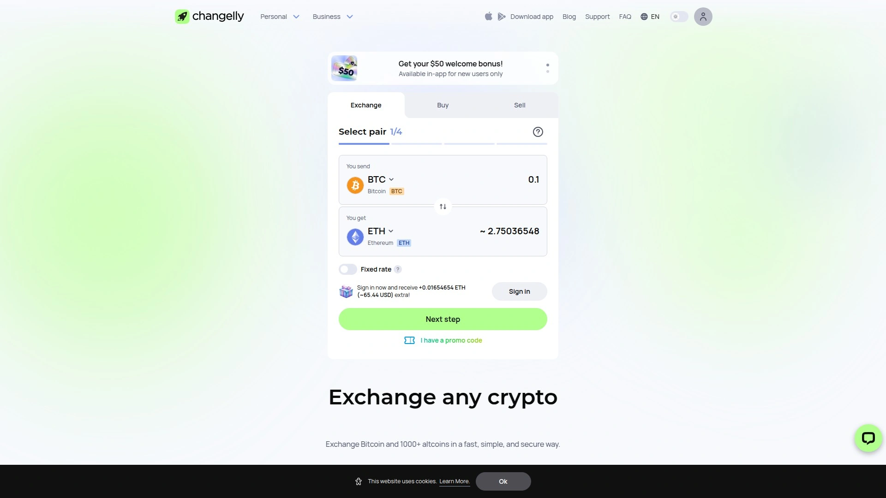

Changelly entered the instant exchange market back in 2015, making it one of the industry veterans that survived multiple crypto winters. That longevity brings advantages: deep liquidity connections across major exchanges, support for over 1,000 cryptocurrencies, and a refined interface that reflects years of user feedback. The platform operates as a non-custodial service, meaning your funds never sit in Changelly's wallets—transactions move directly from your wallet to the destination address.

The KYC situation with Changelly involves some nuance: standard swaps typically don't require verification, but the platform reserves the right to request identity documents if automated systems flag a transaction. This approach won't satisfy absolute privacy maximalists, but it allows the platform to maintain relationships with liquidity providers while keeping most users anonymous. Swap times range from 5 to 40 minutes depending on the trading pair and blockchain traffic.

Mobile applications for both iOS and Android extend functionality beyond desktop, and the platform integrates with popular hardware wallets like Ledger and Trezor for users who want to swap without exposing their private keys. Fee structures run up to 0.25%, which sits on the higher end compared to some competitors but often gets offset by better rates due to Changelly's aggregated liquidity sourcing. Customer support operates around the clock with generally responsive service, though peak times can stretch response windows.

***

## **[FixedFloat](https://fixedfloat.com)**

Rate protection specialists with lightning-fast processing.

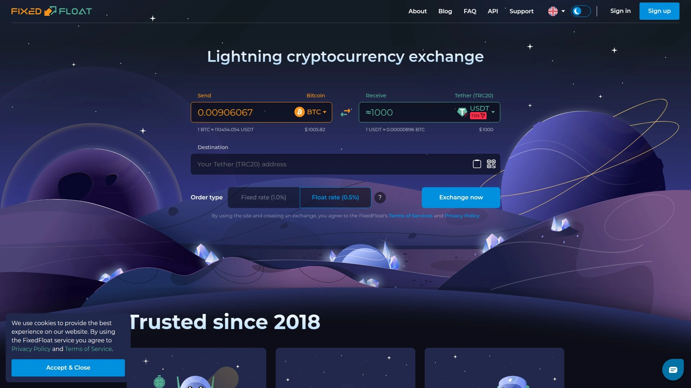

FixedFloat carved out its niche by obsessing over exchange rate stability and transaction speed. The platform's signature feature—aggressive rate locking that holds for 10 minutes on fixed swaps—gives you tight windows to complete transactions without volatility risk. This matters particularly for traders working with fast-moving altcoins where a 5% price swing during confirmation can wreck your intended trade. Processing operates through complete automation with minimal manual intervention, which translates to impressive completion speeds once your deposit confirms.

Both fixed and floating rate options accommodate different trading strategies, and the interface makes switching between them intuitive. The platform handles Lightning Network transactions for Bitcoin swaps, which opens up instant settlement possibilities for traders who've set up Lightning wallets. No registration or identity verification clutters the experience—you get a clean swap interface that respects the original crypto ethos of pseudonymous transactions.

The team behind FixedFloat consists of blockchain professionals with backgrounds in finance and technology, and that expertise shows in the platform's robust infrastructure. Uptime stays consistently high, and when network issues do occur, the customer support team responds with technical competence rather than scripted deflections. The platform maintains competitive fee structures with transparent pricing that doesn't hide costs in misleading spread calculations.

***

## **[StealthEX](https://stealthex.io)**

Privacy-first swaps with zero data collection below $700.

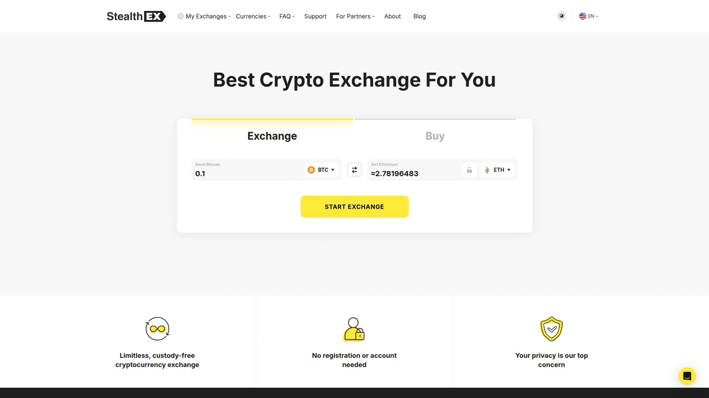

StealthEX positions itself squarely in the privacy-conscious segment of instant exchanges, with policies designed specifically for users who treat transaction anonymity as non-negotiable. The platform supports over 1,400 cryptocurrencies and handles swaps up to $700 without any KYC requirements whatsoever—no account creation, no email collection, no IP logging that could later connect your transactions. Above that threshold, verification requirements kick in, but for most everyday swaps the platform operates completely anonymously.

The user interface emphasizes simplicity and speed, stripping away unnecessary features to focus purely on the core swap functionality. Mobile apps for iOS and Android maintain the same privacy-first approach, letting you execute swaps on the go without compromising anonymity. Transaction times typically complete within minutes for popular pairs, though actual speed depends on blockchain confirmation requirements and network congestion.

What distinguishes StealthEX from competitors claiming privacy is the platform's explicit no-data-storage policy. Transaction records don't persist beyond what's necessary for technical processing, and there's no advertising network tracking or third-party analytics watching your activity. The 24/7 customer support operates with genuine helpfulness rather than bureaucratic deflection, and the team responds via encrypted channels when users request additional privacy measures.

***

## **[LetsExchange](https://letsexchange.io)**

The cross-chain specialist with 5,800+ supported assets.

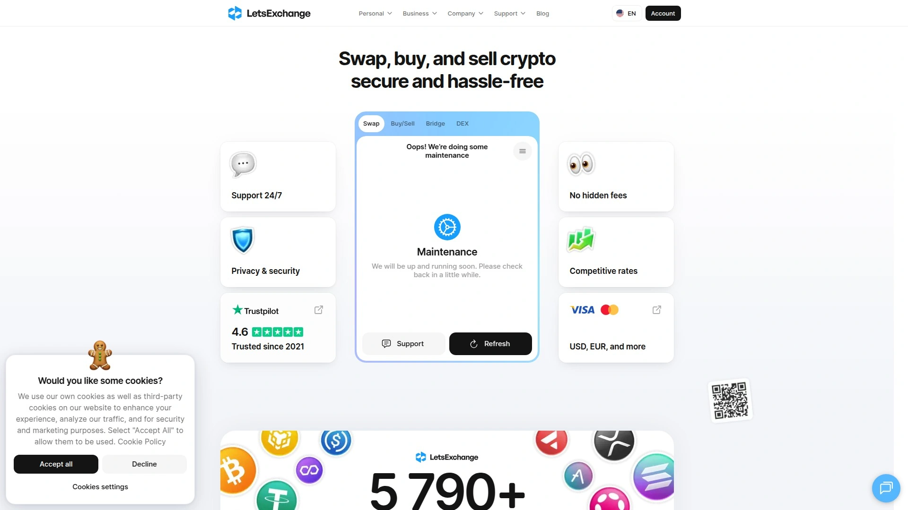

LetsExchange dominates the instant exchange landscape in one specific metric: sheer asset coverage. With support for over 5,800 cryptocurrencies across dozens of blockchains, the platform handles obscure tokens and emerging projects that most competitors haven't even heard of. This makes it particularly valuable for DeFi participants and early-stage project investors who need to move between chains without setting up complicated bridging operations.

Cross-chain swaps represent the platform's specialty, with infrastructure specifically designed to facilitate seamless transactions between different blockchain ecosystems. Whether you're moving from Bitcoin to Solana ecosystem tokens, or swapping Ethereum-based assets for Polkadot network coins, LetsExchange handles the technical complexity behind a simple interface. No registration or KYC requirements obstruct the process—you simply select your trading pair, enter amounts and addresses, and execute the swap.

Transaction speeds average around 5 minutes for standard pairs, with the platform's optimized routing finding efficient pathways between chains. The fee structure maintains transparency with clearly displayed costs, and pricing stays competitive despite the added complexity of cross-chain operations. Customer support operates 24/7 with personalized service that actually addresses specific issues rather than copy-pasting generic responses. The platform launched in 2021 but rapidly built reputation through reliable execution and expanding asset coverage.

***

## **[Exolix](https://exolix.com)**

Flexible rate options with extended rate locks up to 2 hours.

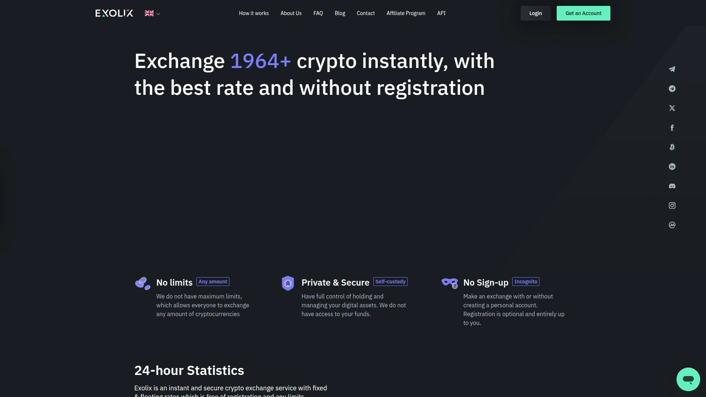

Exolix separates itself from instant exchange competitors through unusually generous rate-lock durations—up to 120 minutes on fixed-rate swaps. This extended window gives you breathing room to coordinate transactions without constantly watching the clock or worrying about rate expiration mid-process. The platform supports both fixed and floating exchange rates, letting you choose stability or potential upside depending on market conditions and your risk tolerance.

Over 2,000 cryptocurrencies spread across 200+ blockchain networks receive support, giving you access to major coins and obscure altcoins through the same interface. No upper transaction limits constrain larger swaps, and the platform handles everything from tiny experimental trades to substantial liquidity movements. The absence of registration requirements and KYC verification (with optional verification available for users who prefer compliance) keeps the experience frictionless.

Security infrastructure operates through automated systems that minimize human intervention points where errors or malicious activity could occur. The platform partners with other services in the crypto ecosystem to expand liquidity access and rate competitiveness, which benefits users through better pricing options. Customer support maintains 24/7 availability through live chat, responding to technical issues and transaction questions with actual expertise rather than deflection tactics.

***

## **[SideShift](https://sideshift.ai)**

Automated no-registration swaps with Trezor hardware wallet integration.

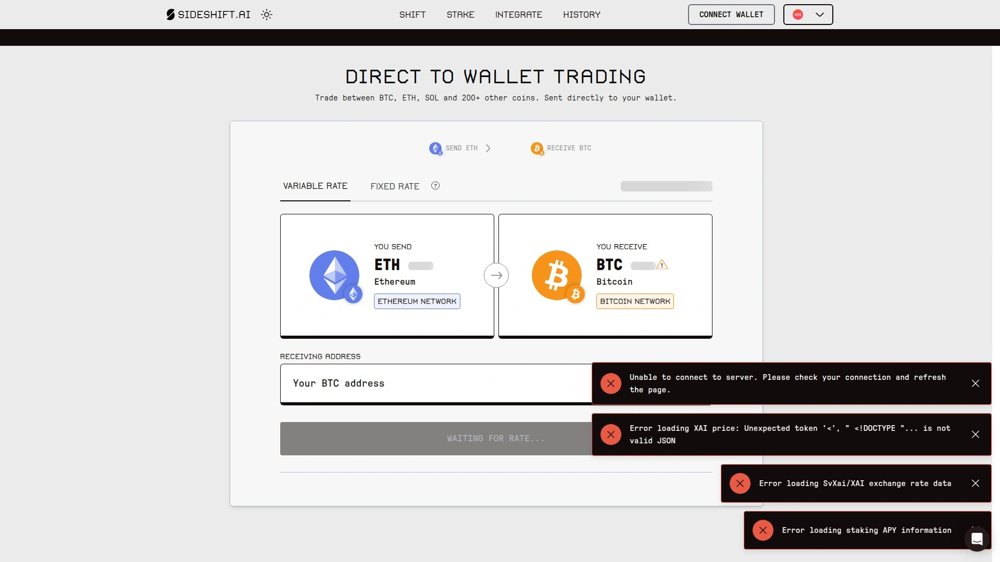

SideShift operates on pure automation principles: deposits receive immediate processing after a single blockchain confirmation, with funds shifting to destination addresses without human intervention or custody holds. The platform never holds user funds at any point in the transaction process, which eliminates custodial risk and keeps your crypto under your control throughout the swap. Supporting 30+ cryptocurrencies may sound limited compared to platforms boasting thousands, but SideShift focuses on liquid, established assets where execution reliability matters more than exotic options.

The platform integrates directly with Trezor Suite, allowing hardware wallet users to execute swaps without leaving their secure environment. This integration matters for security-conscious traders who prefer not to expose their private keys even temporarily during exchange operations. No registration requirements, no data collection, and no KYC verification processes keep the experience streamlined for users who value privacy.

Transaction completion depends on blockchain confirmation speeds, but SideShift's automation typically processes swaps within minutes once deposits confirm. The platform's native token XAI (successor to SAI) exists on the ERC-20 Ethereum blockchain with a capped supply of 210 million tokens, though using the exchange doesn't require holding or purchasing the native token. The straightforward interface removes complexity while maintaining the essential features needed for efficient crypto swapping.

---

## **[TradeOgre](https://tradeogre.com)**

The privacy coin specialist with zero verification requirements.

TradeOgre serves a specific niche in the crypto exchange ecosystem: traders who prioritize privacy coins like Monero and want zero KYC interference. Launched in 2018, the platform maintains a deliberately minimalist approach with over 120 cryptocurrency pairs focused heavily on privacy-oriented assets. There are no verification steps, no forms requesting personal information, and no selfie requirements that have become standard practice on mainstream exchanges.

The platform functions as a centralized exchange rather than an instant swap service, meaning you'll see order books and trading interfaces instead of simple swap calculators. This appeals to traders who want more control over execution prices and the ability to place limit orders rather than accepting market rates. At the time of current records, TradeOgre doesn't list restrictions for US residents in its terms of service, making it one of few centralized options still accessible to American users seeking privacy-focused trading.

The no-frills interface won't win design awards, but it loads fast and keeps distractions minimal. Transaction volume in Monero and other privacy coins remains consistently strong, providing decent liquidity for those specific assets. Customer support operates with less flash than bigger platforms but responds competently to technical issues. The platform represents a practical option for privacy-first traders who understand they're sacrificing polish for principles.

***

## **[GhostSwap](https://ghostswap.io)**

Account-free instant swaps with $650M+ in completed transactions.

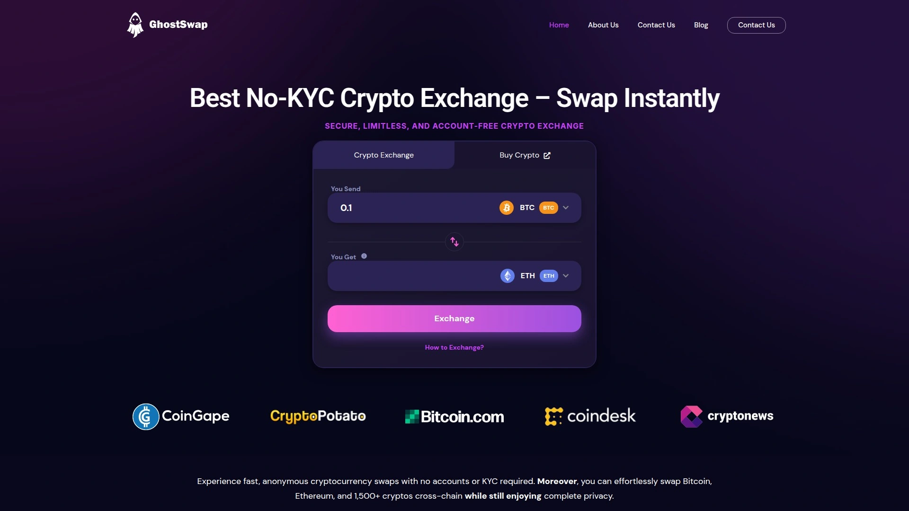

GhostSwap has processed over $650 million in cryptocurrency swaps since launch, building credibility through consistent execution and privacy-focused operations. The platform supports 1,500+ cryptocurrencies across major blockchains, handling everything from Bitcoin and Ethereum to emerging DeFi tokens. Cross-chain functionality operates seamlessly, letting you swap between different blockchain ecosystems without manual bridging or complex routing.

Complete anonymity defines the GhostSwap experience: no accounts, no registration, no KYC verification, and no data retention beyond technical transaction necessities. You select your trading pair, provide receiving addresses, send crypto to the deposit address, and receive your swapped assets within minutes. The custody-free architecture means GhostSwap never holds your funds—you maintain control throughout the entire swap process.

Transaction speeds typically complete within a few minutes once deposits confirm, with a public tracker letting you monitor progress in real-time. The user interface prioritizes simplicity over feature bloat, making swaps straightforward even for users new to instant exchanges. Global accessibility ensures anyone can use the platform regardless of location, provided cryptocurrency transactions remain legal in their jurisdiction. The platform's growing user base (over 1 million satisfied users) suggests consistent reliability and competitive rates.

***

## **[TorrentSwap](https://torrentswap.com)**

Self-custody cross-chain swaps with audited smart contracts.

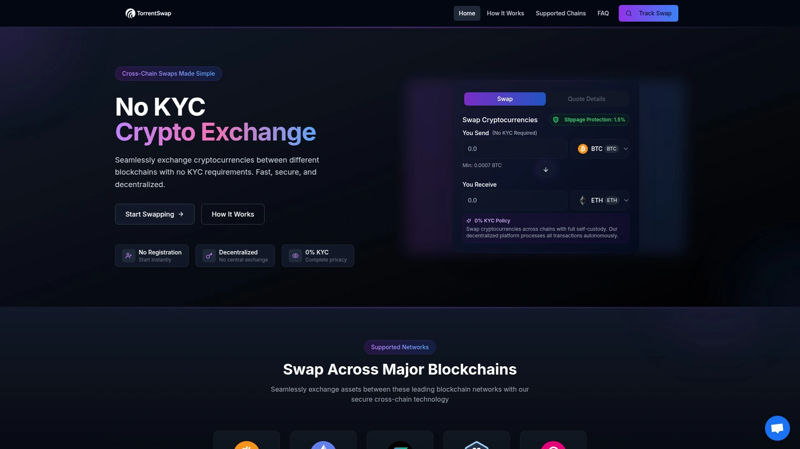

TorrentSwap operates as a self-custody platform where users maintain complete control over their assets throughout the entire swap process. Unlike centralized exchanges that take temporary custody during transactions, TorrentSwap executes trades through audited non-custodial smart contracts that source liquidity on-chain. This architectural approach eliminates the risk of platform hacks affecting user funds, since there's nothing for attackers to steal from centralized wallets.

Zero KYC requirements apply across all transaction sizes—no sign-ups, no identity checks, no data collection. The platform supports major blockchains including Bitcoin, Ethereum, Solana, Arbitrum, and Polkadot, facilitating cross-chain swaps within single transactions. Typical completion times run under 30 minutes, with real-time quotes displaying exact outputs, fees, and potential slippage before you commit.

Decentralized liquidity sourcing means the platform doesn't rely on a single centralized provider—trades execute through on-chain liquidity pools that operate independently. Transparent pricing eliminates hidden costs, and a public tracker provides full visibility into swap status throughout processing. The platform's focus on privacy, autonomy, and decentralized infrastructure appeals specifically to users who treat self-sovereignty as non-negotiable. Global access remains unrestricted, allowing anyone with a crypto wallet to execute swaps regardless of geographic location.

---

## **[Bisq](https://bisq.network)**

The decentralized P2P exchange for maximum privacy and censorship resistance.

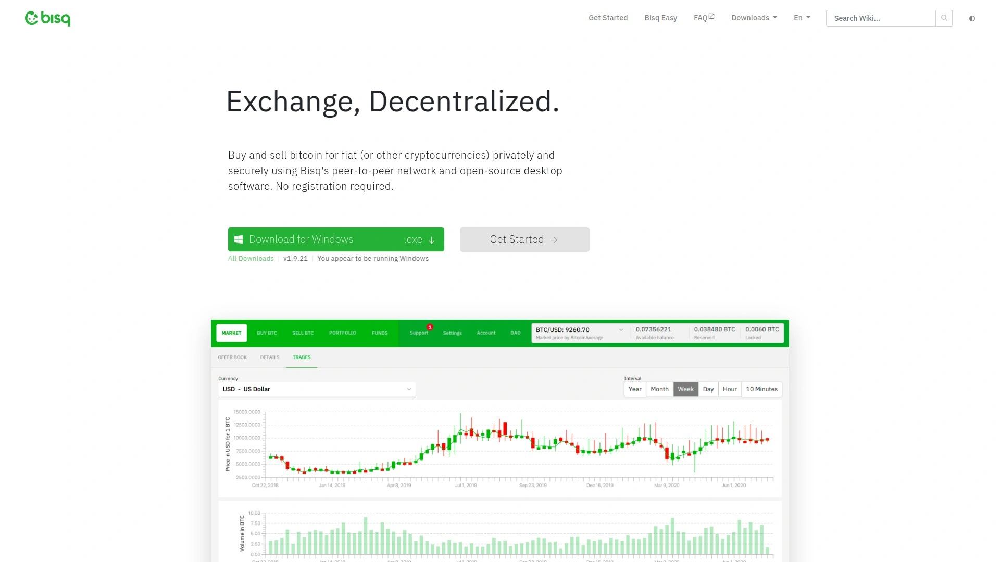

Bisq represents the extreme end of decentralization in cryptocurrency exchanges—a fully peer-to-peer platform with no company, no centralized servers, and no possibility of censorship. The open-source desktop application connects traders directly for buying and selling Bitcoin in exchange for national currencies or alternative cryptocurrencies. Active since 2016, Bisq pioneered the model of truly decentralized trading long before it became fashionable.

Privacy protection operates through network-level anonymity and the absence of any centralized data collection. There's no KYC verification, no account creation, and no email registration—you download the software, and you're trading. The platform requires posting security deposits for trades, which protects both parties from fraud while maintaining the decentralized trust model. This adds complexity compared to instant swap services, but delivers unmatched censorship resistance and privacy for users willing to navigate the learning curve.

Trade execution happens slower than centralized platforms since you're matching with real counterparties rather than automated liquidity pools. Finding available offers for specific currency pairs sometimes requires patience, and the user experience demands more technical understanding than mainstream exchanges. The fee structure involves 0.001 BTC for both makers and takers. For users prioritizing principles over convenience, Bisq delivers genuine decentralization that no centralized platform can match.

***

## **[Uniswap](https://uniswap.org)**

The DeFi leader for ERC-20 token swaps without accounts.

Uniswap pioneered the automated market maker model that now dominates decentralized finance, processing billions in daily trading volume across Ethereum and Layer-2 networks. The protocol requires no KYC verification, no account creation, and no permission from any centralized authority—you connect a wallet and start trading. Deep liquidity for ERC-20 tokens makes Uniswap the default choice for Ethereum ecosystem participants who need reliable pricing and execution.

Support extends across Ethereum mainnet and major Layer-2 networks including Arbitrum, Optimism, and Base, giving you options for lower transaction costs when gas fees spike. The decentralized architecture means no company controls your funds or can freeze your transactions—smart contracts handle everything according to predetermined code. Trading opportunities span stablecoins, major tokens, meme coins, and obscure DeFi experiments, with liquidity providers earning fees for supplying capital to pools.

Technical expertise requirements run higher than centralized exchanges since you're managing wallet connections, gas fees, and slippage settings directly. The platform offers no customer support in the traditional sense—you're interacting with immutable smart contracts, so understanding transaction mechanics becomes your responsibility. Security remains strong assuming you protect your private keys properly, though the decentralized nature means no recourse exists for user errors like sending tokens to wrong addresses. For Ethereum users who prioritize decentralization and liquidity depth, Uniswap delivers unmatched access to ERC-20 trading.

***

## **[PancakeSwap](https://pancakeswap.finance)**

The BNB Smart Chain DEX with cheap fees and diverse features.

PancakeSwap dominates the Binance Smart Chain ecosystem as the leading decentralized exchange, offering fast transactions and exceptionally low gas fees. The platform requires zero KYC or account creation—you connect your wallet and access instant trading across a wide variety of tokens. Beyond basic swaps, PancakeSwap integrates yield farming, staking, NFT marketplace functionality, and even lottery features into a comprehensive DeFi platform.

BNB Chain's low transaction costs make PancakeSwap particularly attractive for smaller trades where Ethereum's gas fees would consume too much of the transaction value. The platform supports BNB, BUSD, stablecoins, popular meme coins, and numerous altcoins with varying liquidity levels. Yield farming and staking opportunities let users earn returns on crypto holdings beyond simple trading, though these activities carry their own risks and complexity.

The user interface balances feature richness with usability, though newcomers may find the abundance of options initially overwhelming. Smart contract security has been audited multiple times, and the platform's longevity and high TVL (total value locked) provide some confidence in its robustness. Community governance through the CAKE token gives users voting rights on platform development. For users who want to explore DeFi beyond simple swaps while keeping costs minimal, PancakeSwap offers versatile functionality on a fast, cheap blockchain.

---

## **[Changeum](https://changeum.io)**

The low-fee speedster with 0.5-1% rates and fast execution.

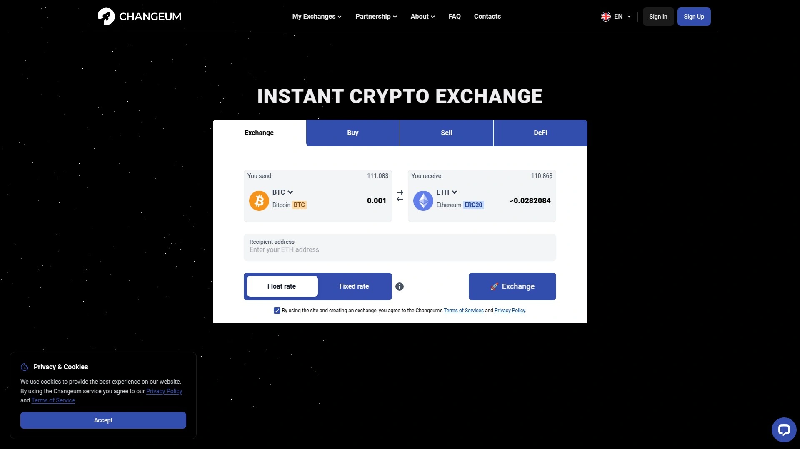

Changeum carved its niche by optimizing for two metrics that matter most to practical traders: low fees and fast completion times. The platform charges 0.5-1% on swaps, which undercuts many competitors while maintaining reliable execution. Average swap times rank among the fastest in the instant exchange category, typically completing transactions within minutes once deposits confirm.

The platform operates without KYC requirements for standard transactions, keeping the swap process straightforward and privacy-respecting. Asset coverage includes major cryptocurrencies and popular altcoins, though the selection focuses on liquid trading pairs rather than exhaustive token listings. This targeted approach ensures better pricing and faster execution for the assets most users actually trade.

The interface emphasizes speed and simplicity, removing unnecessary features that slow down the swap process. Transparent pricing displays all costs upfront without hidden fees buried in exchange rate spreads. While Changeum lacks the extensive asset coverage or advanced features of some competitors, it excels at its core mission: completing swaps quickly and cheaply. For cost-conscious traders who prioritize execution efficiency over exotic token access, Changeum delivers excellent value.

---

## FAQ

**Do these platforms really not require identity verification for crypto swaps?**

Most platforms on this list process swaps without KYC for standard transaction amounts, typically ranging from no limits at all to thresholds around $700-$1,000. Some services like ChangeNOW and Changelly reserve the right to request verification if automated systems flag suspicious activity, while others like StealthEX and GhostSwap maintain strict no-KYC policies below certain amounts. Decentralized options like Uniswap and PancakeSwap involve zero verification since you're interacting directly with smart contracts.

**How long do instant crypto exchanges typically take to complete swaps?**

Completion times range from 5 minutes to 30 minutes for most platforms, depending on blockchain confirmation requirements and network congestion. Faster blockchains like BNB Chain through PancakeSwap complete within minutes, while Bitcoin transactions may take longer during high network traffic. Platforms like ChangeNOW and Changeum specifically optimize for speed and consistently deliver quick executions.

**Are non-KYC crypto exchanges safe to use?**

Security depends more on architectural design than KYC policies. Non-custodial platforms like TorrentSwap and decentralized exchanges like Uniswap never hold your funds, eliminating custodial risk entirely. Instant swap services with established track records like Godex, FixedFloat, and ChangeNOW have processed millions of transactions reliably. The main risks involve user error (sending to wrong addresses) and choosing unvetted platforms—stick with established services that have demonstrated consistent execution.

***

## Conclusion

Privacy and speed don't need to be mutually exclusive in crypto trading, and these 16 platforms prove the point by handling swaps efficiently without demanding your passport. [Godex.io](https://godex.io) holds the top position for good reason: supporting 900+ cryptocurrencies with no transaction limits and genuinely zero KYC makes it the practical choice for traders who value both selection and anonymity. Whether you're swapping Bitcoin for Monero, testing out DeFi tokens, or moving stablecoins between chains, these exchanges keep the process direct and respectful of your privacy.
